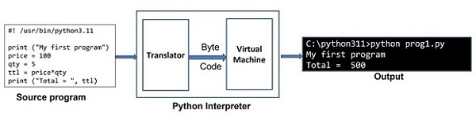

# Python Interpreter

Python adalah bahasa yang berbasis *interpreter*. Pada sistem Linux, file executable Python biasanya berada di direktori **/usr/bin/**. Untuk Windows, executable-nya (**python.exe**) terletak di folder instalasi (misalnya **C:\python311**).

Tutorial ini akan menjelaskan cara kerja Python Interpreter dalam mode interaktif maupun mode skrip. Kode Python dieksekusi dengan metode *satu pernyataan pada satu waktu*. Interpreter Python memiliki dua komponen:

1. **Translator** – memeriksa pernyataan untuk memastikan sintaksnya benar. Jika benar, translator menghasilkan *byte code* perantara.
2. **Python Virtual Machine (PVM)** – mengubah *byte code* tersebut menjadi *native binary* dan mengeksekusinya.

Diagram berikut menggambarkan mekanismenya:

<figure markdown="span">
  { width="700" }
</figure>

Python interpreter memiliki **mode interaktif** dan **mode skrip**.

## Python Interpreter – Mode Interaktif

Saat dijalankan dari terminal tanpa opsi tambahan, Python akan menampilkan prompt `>>>` dan interpreter bekerja dengan prinsip **REPL** (*Read, Evaluate, Print, Loop*). Setiap perintah yang kamu ketik akan dibaca, diterjemahkan, lalu dieksekusi. Contoh sesi interaktif:

```
>>> price = 100
>>> qty = 5
>>> total = price * qty
>>> total
500
>>> print("Total = ", total)
Total = 500
```

Untuk menutup sesi interaktif, tekan karakter akhir baris (**Ctrl+D** untuk Linux, **Ctrl+Z** untuk Windows). Kamu juga bisa mengetik `quit()` lalu tekan Enter.

```
>>> quit()

$
```

Shell interaktif bawaan Python tidak memiliki fitur seperti **line editing**, **history search**, atau **auto-completion**. Untuk fitur lebih canggih, kamu bisa menggunakan **IPython** atau **bpython**.

## Python Interpreter – Mode Skrip

Daripada memasukkan perintah satu per satu seperti di mode interaktif, kamu bisa menyimpan sekumpulan instruksi ke dalam file teks berekstensi **.py**, lalu menjalankannya sebagai argumen perintah Python.

Simpan baris berikut sebagai `prog.py` menggunakan editor apa saja (vim di Linux atau Notepad di Windows):

```python
print("My first program")
price = 100
qty = 5
total = price * qty
print("Total = ", total)
```

Jalankan program tersebut di Windows:

```
C:\Users\Acer>python prog.py
My first program
Total = 500
```

Walaupun Python mengeksekusi seluruh skrip sekaligus, secara internal eksekusi tetap berlangsung **baris demi baris**.

Pada bahasa berbasis compiler seperti Java, kode sumber tidak akan diubah menjadi bytecode jika masih ada kesalahan. Di Python, pernyataan akan dieksekusi hingga terjadi error pertama.

Contoh kesalahan yang dimaksud:

```python
print("My first program")
price = 100
qty = 5
total = prive * qty  # Error pada baris ini
print("Total = ", total)
```

Perhatikan salah ketik `prive` alih-alih `price`. Jalankan kembali:

```
C:\Users\Acer>python prog.py
My first program
Traceback (most recent call last):
  File "C:\Python311\prog.py", line 4, in <module>
    total = prive * qty
    ^^^^^
NameError: name 'prive' is not defined. Did you mean: 'price'?
```

Baris sebelum error tetap dijalankan, lalu muncul pesan kesalahan. Ini menunjukkan bahwa skrip Python dieksekusi secara **interpreted**.

## Python Interpreter – Menggunakan Shebang #!

Selain menjalankan skrip dengan perintah Python, kamu bisa membuat skrip menjadi **self-executable** di Linux seperti shell script. Tambahkan baris **shebang** di bagian paling atas. Shebang menunjukkan interpreter mana yang harus digunakan.

Modifikasi `prog.py`:

```python
#! /usr/bin/python3.11

print("My first program")
price = 100
qty = 5
total = price * qty
print("Total = ", total)
```

Jadikan skrip executable:

```
$ chmod +x prog.py
```

Sekarang kamu bisa menjalankan langsung tanpa memanggil python secara manual:

```
$ ./hello.py
```

## Interactive Python – IPython

**IPython** (*Interactive Python*) adalah lingkungan interaktif yang lebih canggih dan kaya fitur dibanding shell Python standar. IPython dibuat oleh Fernando Perez pada tahun 2001.

Fitur penting IPython:

* **Object introspection**, untuk memeriksa properti objek saat runtime.
* **Syntax highlighting**, membantu mengenali elemen bahasa seperti keyword dan variabel.
* Menyimpan **riwayat interaksi** yang dapat dipanggil kembali kapan saja.
* **Tab completion** untuk keyword, variabel, dan nama fungsi.
* Sistem **Magic commands** yang berguna untuk mengontrol lingkungan Python dan menjalankan tugas OS.
* Menjadi **kernel utama** untuk Jupyter Notebook dan alat-alat lain di Project Jupyter.

**Instal IPython dengan utilitas installer PIP**

```
pip3 install ipython
```

**Jalankan IPython dari command line**

```
C:\Users\Acer>ipython
Python 3.11.2 (tags/v3.11.2:878ead1, Feb 7 2023, 16:38:35) [MSC v.1934
64 bit (AMD64)] on win32
Type 'copyright', 'credits' or 'license' for more information
IPython 8.4.0 -- An enhanced Interactive Python. Type '?' for help.
In [1]:
```

Alih-alih prompt standar `>>>`, IPython menampilkan dua jenis prompt utama:

* **In[1]** muncul sebelum ekspresi yang kita input.
* **Out[1]** muncul sebelum output yang dihasilkan.

Contoh sesi:

```
In [1]: price = 100
In [2]: quantity = 5
In [3]: total = price*quantity
In [4]: total
Out[4]: 500
In [5]:
```

**Tab completion** adalah salah satu fitur paling berguna di IPython. Setelah mengetik nama objek lalu titik (`.`), menekan tombol *Tab* akan menampilkan daftar metode yang relevan.

IPython juga menyediakan fitur **introspeksi**, yaitu melihat informasi suatu objek dengan menambahkan tanda tanya `?` setelah nama objek. IPython akan menampilkan docstring, definisi fungsi, hingga detail konstruktor.

Contoh:

```
In [5]: var = "Hello World"
In [6]: var?
Type: str
String form: Hello World
Length: 11
Docstring:
str(object='') -> str
str(bytes_or_buffer[, encoding[, errors]]) -> str
Create a new string object from the given object. If encoding or
errors is specified, then the object must expose a data buffer
that will be decoded using the given encoding and error handler.
Otherwise, returns the result of object.__str__() (if defined)
or repr(object).
encoding defaults to sys.getdefaultencoding().
errors defaults to 'strict'.
```

IPython juga punya **magic functions** yang sangat kuat. Misalnya, *line magic* memungkinkan kita menjalankan perintah OS langsung dari dalam IPython.

Contoh menjalankan perintah *dir*:

```
In [8]: !dir *.exe
 Volume in drive F has no label.
 Volume Serial Number is E20D-C4B9

 Directory of F:\Python311

07-02-2023 16:55            103,192 python.exe
07-02-2023 16:55            101,656 pythonw.exe
                2 File(s)    204,848 bytes
                0 Dir(s)  105,260,306,432 bytes free
```

**Jupyter Notebook** adalah antarmuka berbasis web untuk berbagai lingkungan pemrograman seperti Python, Julia, R, dan lainnya. Untuk Python, Jupyter menggunakan IPython sebagai kernel utamanya.
